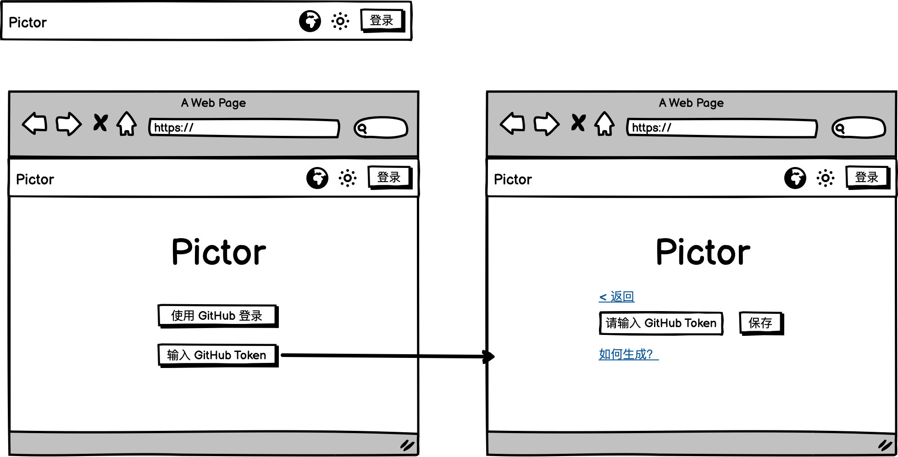

任务计划：
整个项目不需要后端功能，只是一个单纯的 WebApp，界面设计现代一点你可以用一些自主的技术选型（nextjs 或者其他东西都可以）。
1. 实现一个通过 Github Token 的登录界面，如果 cookie 里有就跳到主页
设计图大概张这样：

（基本完成）

第二步
2. 点击 Token 保存的跳转页面会进入主页（token 有 cache 不清理应该免登录）：
主页 design/main.png 设计图，主要功能通过 token + github api 选择某个仓库或者创建新仓库为 Gallery，下面是已经选择的 Gallery 列表，这些信息都在前端有 Cache 比较好。

（基本完成）

第三步

3. 点击一个 Gallery 会进入到这个 Gallery 的详情页
Gallery 的详情页会先对 Github Repo 进行读取：
3.1 我们假定 Repo 里有一个叫 Config.yml 的文件，可以参考 https://github.com/lfkdsk/gallery/blob/master/CONFIG.yml 里面的这些参数：
```

thumbnail_url: https://cdn.jsdelivr.net/gh/lfkdsk/gallery@thumbnail/
base_url: https://cdn.jsdelivr.net/gh/lfkdsk/gallery@master
backup_base_url: https://raw.githubusercontent.com/lfkdsk/gallery/master
backup_thumbnail_url: https://raw.githubusercontent.com/lfkdsk/gallery/thumbnail
```
可以用来拼装图片链接以及缩略图链接，这些之后可以配置，我们暂时先不讨论。
3.2 我们假定 Repo 里有一个叫 README.yml 的文件，可以参考 https://github.com/lfkdsk/gallery/blob/master/README.yml ，里面的写作顺序代表每个相册的顺序。
``` yaml
Ruby Lake:
  url: RubyLakeTrail
  date: 2025-08-31
  style: fullscreen
  cover: RubyLakeTrail/IMG_3363.webp
  location: [37.41588277200025, -118.7716685680481]
```
每一项包含如下图所示的信息，代表相册的名称、url（Github Repo 内部的文件名）、日期、样式、封面图、位置。
你先对 repo 的 README.yml 进行读取，每一个 Item 显示为卡片（封面为 thumbnail_url 或 backup_thumbnail_url cover ）。

（基本完成）

第四步

4. 先提供为某个相册增加图片的功能，入口和删除图片的按钮并列
增加图片可以设计为一套通用的组件：首先进入一个新的页面进行图片选择，图片筛选器可以选择非图片（因为我们支持 LivePhoto 功能，因此不要限制上传的内容）
4-1. 选择之后的卡片会显示每个图的大小和文件名
4-2. 逐个使用浏览器压缩， squoosh-browser 库压缩，这个仓库不会保留文件的 EXIF （这是我们需要的），因此压缩前需要先保留 EXIF 信息，压缩后需要再将 EXIF 信息写入压缩后的图片，可以参考 https://github.com/PodcastsArchive/picx/blob/master/src/utils/compress-image.ts 我的实现：
```
import Compress from '@yireen/squoosh-browser'
import { CompressEncoderEnum } from '@/common/model'
import { isNeedCompress } from '@/utils/file-utils'
import { insert, load, dump, TagNumbers } from '@lfkdsk/exif-library'

/**
 * 压缩图片
 * @param file
 * @param encoder
 */
export const compressImage = async (file: File, encoder: CompressEncoderEnum) => {
  if (!isNeedCompress(file.type)) {
    return file
  }

  const compress = new Compress(file, {
    encoderState: {
      type: encoder,
      options: encoderMap[encoder].meta.defaultOptions
    } as EncoderState,
    processorState: defaultProcessorState,
    preprocessorState: defaultPreprocessorState
  })

  function readFileAsString(file: File) {
    return new Promise<string>((resolve, reject) => {
      const reader = new FileReader()

      reader.onload = () => {
        resolve(reader.result as string)
      }

      reader.onerror = () => {
        reader.abort()
        reject(new DOMException('Problem parsing input file.'))
      }

      reader.readAsBinaryString(file)
    })
  }

  function writeFileWithBuffer(data: string) {
    const len = data.length
    const bytes = new Uint8Array(len)
    for (let i = 0; i < len; i++) {
      bytes[i] = data.charCodeAt(i)
    }
    return bytes
  }

  const data = await readFileAsString(file)
  const result = await compress.process()
  try {
    const originEXIF = load(data)
    console.log(originEXIF)
    if (TagNumbers.ImageIFD.Orientation in originEXIF["0th"]) {
          delete originEXIF["0th"][TagNumbers.ImageIFD.Orientation];
    }
    const newData = await readFileAsString(result)
    const newDataWithEXIF = insert(dump(originEXIF), newData)
    return new File([writeFileWithBuffer(newDataWithEXIF)], result.name, { type: result.type })  
    // return result;
  } catch (error) {
    console.error(error);
    return result;
  }
}
```
无法压缩的文件就不压缩（非图片），保持原状上传
4-3. 压缩之后会显示压缩后的图片大小和文件名
4-4. 点击上传会逐个上传到目标文件夹内，展示进度条以及结束通知