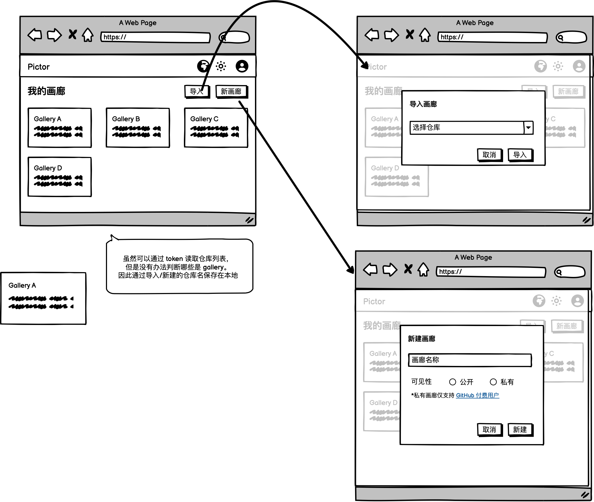

# 📸 PicG - GitHub相册管理系统

<div align="center">



**基于GitHub的现代化相册管理平台**

[](https://nextjs.org/)
[](https://reactjs.org/)
[](https://www.typescriptlang.org/)
[](https://docs.github.com/en/developers/apps/building-oauth-apps)

[在线演示](https://picg.vercel.app) • [快速开始](#-快速开始) • [功能特性](#-功能特性) • [部署指南](#-部署)

</div>

## 🌟 项目简介

PicG 是一个基于GitHub的现代化相册管理系统，让你可以轻松地将GitHub仓库转换为精美的在线相册。通过GitHub OAuth认证，安全地管理你的照片，支持多种布局模式，提供完整的相册管理功能。

### ✨ 核心特性

- 🔐 **GitHub OAuth认证** - 安全的GitHub账号登录
- 📁 **仓库管理** - 自动同步GitHub仓库作为相册
- 🖼️ **多种布局** - 网格、瀑布流、紧凑、大图等展示模式
- 📤 **图片上传** - 支持批量上传和图片压缩
- 🎨 **主题切换** - 明暗主题自由切换
- 📱 **响应式设计** - 完美适配桌面和移动设备
- 🗂️ **相册管理** - 创建、编辑、删除相册
- 🏷️ **YAML配置** - 灵活的相册元数据管理
- 🌍 **国际化** - 支持中英文界面

## 🚀 快速开始

### 环境要求

- Node.js 18.17.0 或更高版本
- npm 或 yarn 包管理器
- GitHub账号

### 1. 克隆项目

```bash
git clone https://github.com/your-username/PicG.git
cd PicG
```

### 2. 安装依赖

```bash
npm install
# 或
yarn install
```

### 3. 配置GitHub OAuth

#### 创建GitHub OAuth应用

1. 访问 [GitHub OAuth Apps](https://github.com/settings/applications/new)
2. 填写应用信息：
   ```
   Application name: PicG Gallery
   Homepage URL: http://localhost:3001
   Authorization callback URL: http://localhost:3001/auth/callback
   Application description: A GitHub-based photo gallery application
   ```
3. 获取 `Client ID` 和 `Client Secret`

#### 配置环境变量

创建 `.env.local` 文件：

```bash
# GitHub OAuth配置
NEXT_PUBLIC_GITHUB_CLIENT_ID=your_github_client_id_here
GITHUB_CLIENT_SECRET=your_github_client_secret_here
NEXT_PUBLIC_GITHUB_REDIRECT_URI=http://localhost:3001/auth/callback
```

### 4. 启动开发服务器

```bash
npm run dev
```

访问 [http://localhost:3001](http://localhost:3001) 开始使用！

### 5. 配置向导

首次使用可以访问 [http://localhost:3001/setup](http://localhost:3001/setup) 使用交互式配置向导。

## 📖 功能特性

### 🔐 认证系统

- **GitHub OAuth登录** - 安全的第三方认证
- **Token管理** - 支持Personal Access Token备用方案
- **会话管理** - 自动token验证和刷新
- **权限控制** - 基于GitHub权限的访问控制

### 📁 仓库管理

- **自动发现** - 扫描GitHub仓库作为相册源
- **仓库创建** - 一键创建新的相册仓库
- **权限检查** - 自动验证仓库访问权限
- **分支支持** - 支持多分支管理

### 🖼️ 相册功能

- **相册创建** - 向导式相册创建流程
- **封面设置** - 自定义相册封面图片
- **元数据管理** - YAML格式的相册信息
- **批量操作** - 支持批量上传和删除

### 🎨 界面设计

- **现代化UI** - 基于现代设计语言
- **响应式布局** - 适配各种屏幕尺寸
- **主题系统** - 明暗主题切换
- **动画效果** - 流畅的交互动画

### 📤 图片处理

- **智能压缩** - 自动图片压缩优化
- **格式支持** - 支持JPEG、PNG、WebP等格式
- **EXIF处理** - 保留或清除图片元数据
- **批量上传** - 支持拖拽批量上传

## 🏗️ 技术架构

### 前端技术栈

- **Next.js 14** - React全栈框架
- **React 18** - 用户界面库
- **TypeScript** - 类型安全的JavaScript
- **Styled JSX** - CSS-in-JS样式方案
- **CSS Modules** - 模块化样式管理

### 核心依赖

- **js-yaml** - YAML文件解析
- **@yireen/squoosh-browser** - 图片压缩
- **@lfkdsk/exif-library** - EXIF数据处理

### 开发工具

- **ESLint** - 代码质量检查
- **Prettier** - 代码格式化
- **Jest** - 单元测试框架
- **TypeScript** - 静态类型检查

## 📂 项目结构

```
PicG/
├── src/
│   ├── app/                    # Next.js App Router
│   │   ├── api/               # API路由
│   │   ├── auth/              # 认证相关页面
│   │   ├── gallery/           # 相册页面
│   │   ├── login/             # 登录页面
│   │   ├── main/              # 主页面
│   │   ├── settings/          # 设置页面
│   │   └── setup/             # 配置向导
│   ├── components/            # React组件
│   │   ├── AuthGuard.tsx      # 认证守卫
│   │   ├── GalleryManager.tsx # 相册管理器
│   │   ├── Navbar.tsx         # 导航栏
│   │   ├── UserProfile.tsx    # 用户资料
│   │   └── ...
│   ├── lib/                   # 工具库
│   │   ├── auth.ts           # 认证工具
│   │   ├── github.ts         # GitHub API
│   │   └── ...
│   └── types/                 # TypeScript类型定义
├── design/                    # 设计资源
├── .env.example              # 环境变量示例
├── .env.local                # 本地环境变量
├── next.config.js            # Next.js配置
├── package.json              # 项目依赖
└── README.md                 # 项目文档
```

## 🔧 配置说明

### 环境变量

| 变量名 | 说明 | 必需 |
|--------|------|------|
| `NEXT_PUBLIC_GITHUB_CLIENT_ID` | GitHub OAuth Client ID | ✅ |
| `GITHUB_CLIENT_SECRET` | GitHub OAuth Client Secret | ✅ |
| `NEXT_PUBLIC_GITHUB_REDIRECT_URI` | OAuth回调URL | ✅ |
| `GITHUB_TOKEN` | Personal Access Token (备用) | ❌ |

### GitHub权限要求

OAuth应用需要以下权限：
- `repo` - 访问仓库
- `user:email` - 读取用户邮箱

## 🚀 部署

### Vercel部署（推荐）

1. Fork本项目到你的GitHub
2. 在Vercel中导入项目
3. 配置环境变量
4. 更新GitHub OAuth回调URL

[](https://vercel.com/new/clone?repository-url=https://github.com/your-username/PicG)

### Docker部署

```bash
# 构建镜像
docker build -t picg .

# 运行容器
docker run -p 3000:3000 \
  -e NEXT_PUBLIC_GITHUB_CLIENT_ID=your_client_id \
  -e GITHUB_CLIENT_SECRET=your_client_secret \
  -e NEXT_PUBLIC_GITHUB_REDIRECT_URI=https://yourdomain.com/auth/callback \
  picg
```

### 手动部署

```bash
# 构建项目
npm run build

# 启动生产服务器
npm start
```

## 🧪 开发

### 运行测试

```bash
# 运行所有测试
npm test

# 运行测试并生成覆盖率报告
npm run test:ci
```

### 代码格式化

```bash
# 格式化代码
npm run format

# 检查代码质量
npm run lint
```

### 开发模式

```bash
# 启动开发服务器
npm run dev

# 启动开发服务器（指定端口）
PORT=3001 npm run dev
```

## 🤝 贡献指南

我们欢迎所有形式的贡献！

### 贡献方式

1. Fork 项目
2. 创建特性分支 (`git checkout -b feature/AmazingFeature`)
3. 提交更改 (`git commit -m 'Add some AmazingFeature'`)
4. 推送到分支 (`git push origin feature/AmazingFeature`)
5. 创建 Pull Request

### 开发规范

- 遵循现有的代码风格
- 添加适当的测试
- 更新相关文档
- 确保所有测试通过

## 📄 许可证

本项目采用 MIT 许可证 - 查看 [LICENSE](LICENSE) 文件了解详情。

## 🙏 致谢

- [Next.js](https://nextjs.org/) - 强大的React框架
- [GitHub API](https://docs.github.com/en/rest) - 可靠的API服务
- [Vercel](https://vercel.com/) - 优秀的部署平台
- 所有贡献者和用户的支持

## 📞 联系我们

- 项目主页: [https://github.com/your-username/PicG](https://github.com/your-username/PicG)
- 问题反馈: [Issues](https://github.com/your-username/PicG/issues)
- 功能建议: [Discussions](https://github.com/your-username/PicG/discussions)

---

<div align="center">

**如果这个项目对你有帮助，请给它一个 ⭐️**

Made with ❤️ by [Your Name](https://github.com/your-username)

</div>